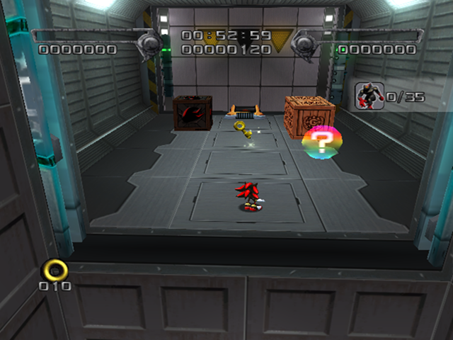
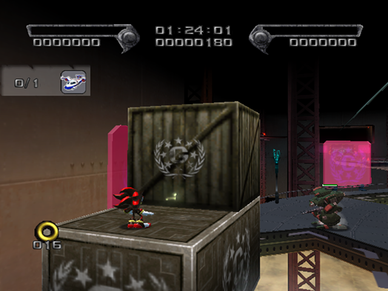
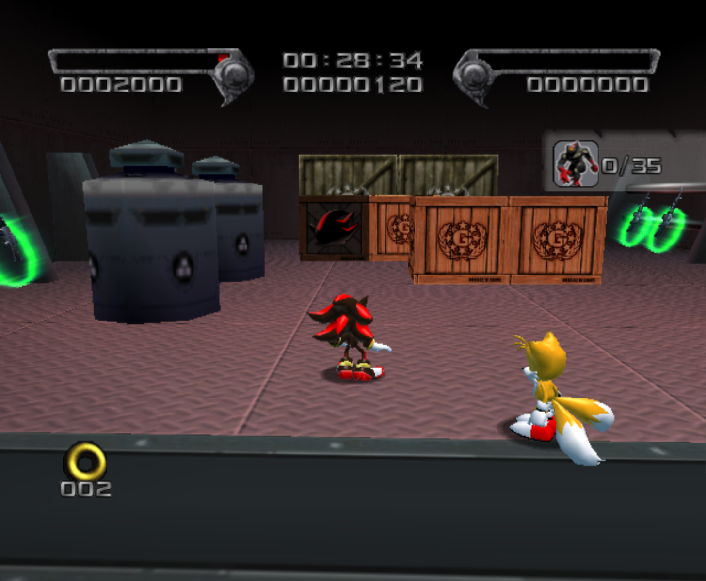
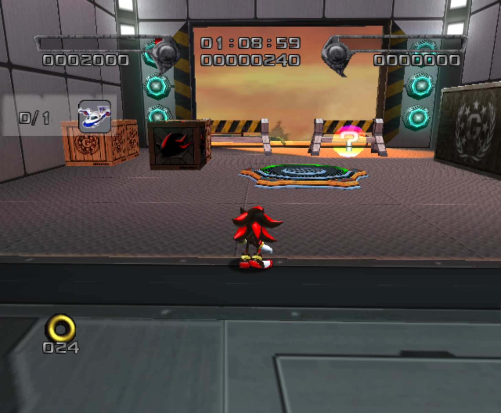
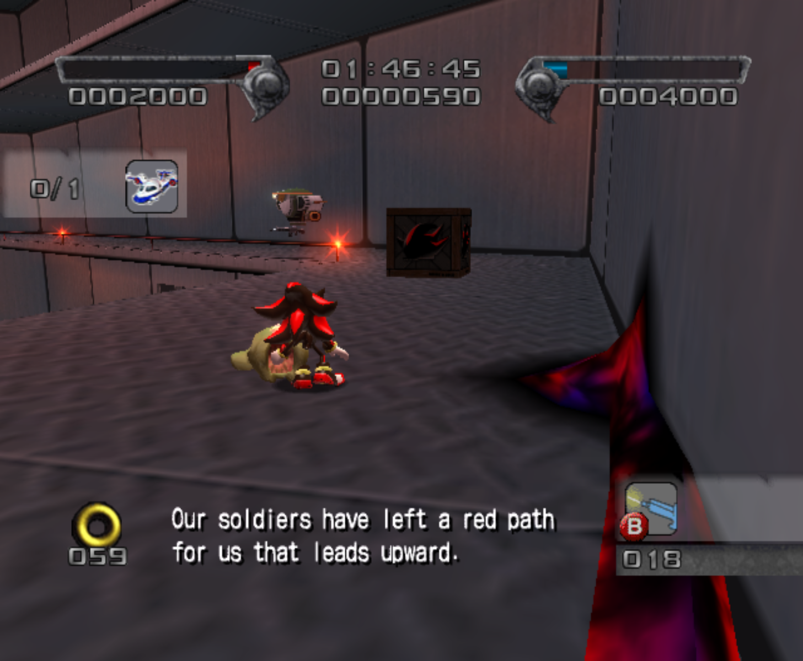

# Air Fleet

<br />

## Next Stages in Story
|Dark|Normal|Hero|
|--|--|--|
|[GUN Fortress](../GUNFortress)|[Black Comet](../BlackComet)|[Lava Shelter](../LavaShelter)|

<br />

## Level Layout
```
<Insert Level Map Here>
```

<br />

## Key Locations
|Key 1|Key 2|Key 3|Key 4|Key 5|
|--|--|--|--|--|
|[  ](../img/AirFleet/AirFleet-Key1.png)|[  ](../img/AirFleet/AirFleet-Key2.png)|[  ](../img/AirFleet/AirFleet-Key3.png)|[  ](../img/AirFleet/AirFleet-Key4.png)|[  ](../img/AirFleet/AirFleet-Key5.png)|

<br />

## Shadow Boxes
| |Box 1|Box 2|Box 3|Box 4|Box 5|Box 6|
|-|-|-|-|-|-|-|
|__Location__|[  ](../img/AirFleet/AirFleet-SpecialWeaponsContainer1.png)|[  ](../img/AirFleet/AirFleet-SpecialWeaponsContainer2.png)|[  ](../img/AirFleet/AirFleet-SpecialWeaponsContainer3.png)|[  ](../img/AirFleet/AirFleet-SpecialWeaponsContainer4.png)|[  ](../img/AirFleet/AirFleet-SpecialWeaponsContainer5.png)|[  ](../img/AirFleet/AirFleet-SpecialWeaponsContainer6.png)|
|__Default Weapon__|Assault Rifle|Assault Rifle|Assault Rifle|Heavy Machine Gun|Assault Rifle|Heavy Machine Gun|

<br />

## Enemies in Stage

<br />

## Weapons Available

<br />

## Notes of Interest

### Air Fleet Dark End Glitch Timing Diferences
TL:DW is that the same value used to fade to black on death is used for fade to white on mission complete.  We can shorted the time it takes to get to the mission complete screen by dying shortly after the objective condition is met, but before the make starts to fad to white. 

This is only allowed for categories that do not rely on the In-Game-Timer for ranking as it sends you back to your last checkpoint which could be the very beginning with a time of 0:00:00.

<br />