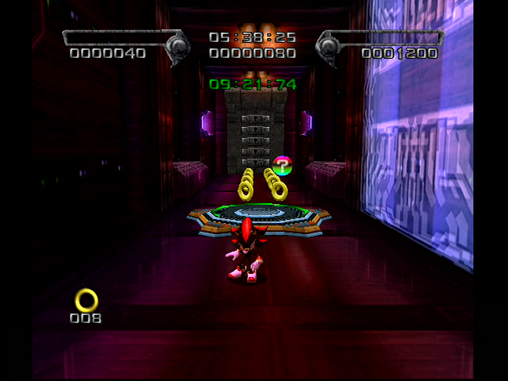
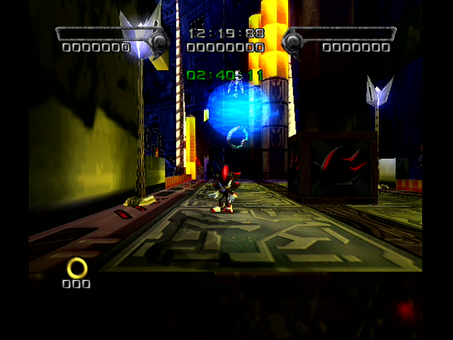

# Cosmic Fall

<br />

## Bosses after Missions
|Dark|Hero|
|--|--|
|[Egg Dealer](../Bosses/EggDealer)|[Black Doom](../Bosses/BlackDoom)|

<br />

## Level Layout
```
<Insert Level Map Here>
```

<br />

## Key Locations
|Key 1|Key 2|Key 3|Key 4|Key 5|
|--|--|--|--|--|
|[  ](../img/CosmicFall/CosmicFall-Key1.png)|[  ](../img/CosmicFall/CosmicFall-Key2.png)|[  ](../img/CosmicFall/CosmicFall-Key3.png)|[  ](../img/CosmicFall/CosmicFall-Key4.png)|[  ](../img/CosmicFall/CosmicFall-Key5.png)|

<br />


## Secret Doors
[  ](../img/CosmicFall/CosmicFallKeyDoor1.png)

The Secret Door in Cosmic Fall has a switch that opens a door near the Key Door. The door blocks an extra life container. The switch also sets many light dash trails throughout the rest of the stage, which are shortcuts for getting to the computer room quickly.

<br />

## Shadow Boxes
| |Box 1|Box 2|
|-|-|-|
|__Location__|[  ](../img/CosmicFall/CosmicFallShadowBox1.png)|[  ](../img/CosmicFall/CosmicFallShadowBox2.png)|
|__Default Weapon__|Heavy Machine Gun|Laser Rifle|

<br />

## Enemies in Stage

<br />

## Weapons Available

<br />

## Notes of Interest

<br />