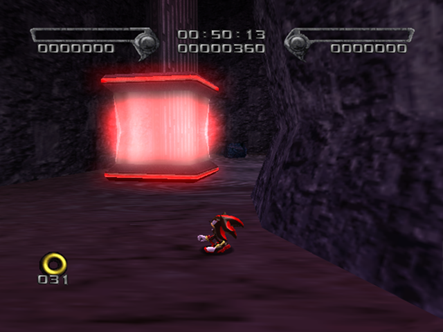
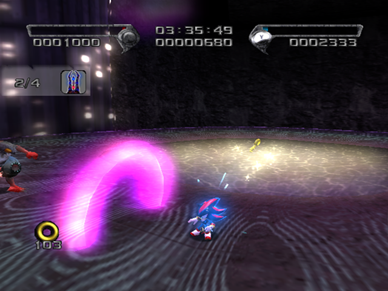

# Final Haunt

<br />

## Boss After Missions
|Dark|Hero|
|--|--|
|[Sonic and Diablon](../Bosses/SonicAndDiablon)|[Black Doom](../Bosses/BlackDoom)|

<br />

## Level Layout
```
<Insert Level Map Here>
```

<br />

## Key Locations
|Key 1|Key 2|Key 3|Key 4|Key 5|
|--|--|--|--|--|
|[  ](../img/FinalHaunt/FinalHaunt-Key1.png)|[  ](../img/FinalHaunt/FinalHaunt-Key2.png)|[  ](../img/FinalHaunt/FinalHaunt-Key3.png)|[  ](../img/FinalHaunt/FinalHaunt-Key4.png)|[  ](../img/FinalHaunt/FinalHaunt-Key5.png)|

<br />

## Shadow Boxes
| |Box 1|Box 2|Box 3|
|-|-|-|-|
|__Location__|X|x|X|
|__Default Weapon__|Ring Shot|Ring Shot|Heavy Shot|

<br />

## Enemies in Stage

<br />

## Weapons Available

<br />

## Notes of Interest

<br />