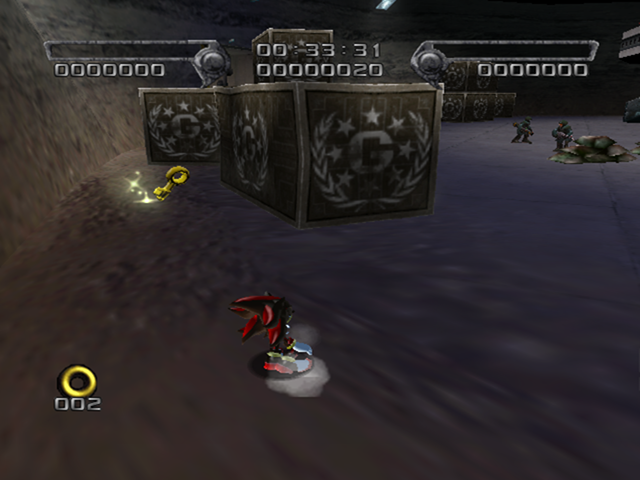
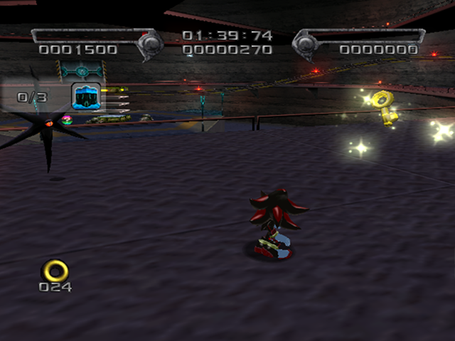
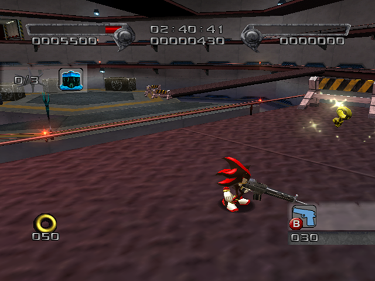
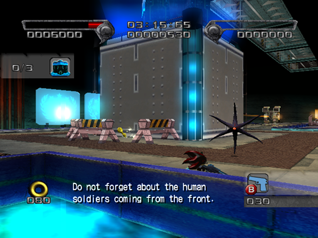
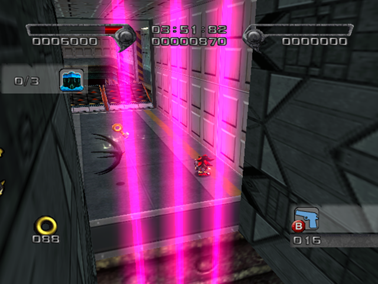
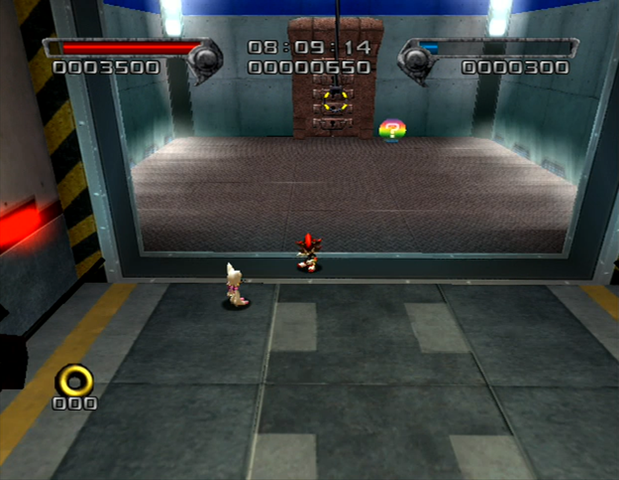
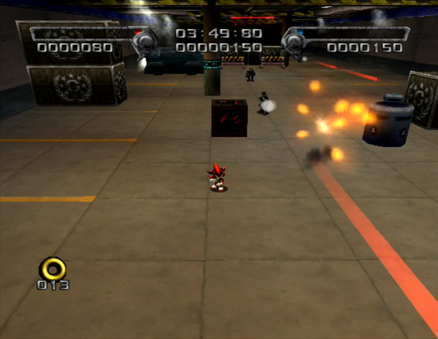
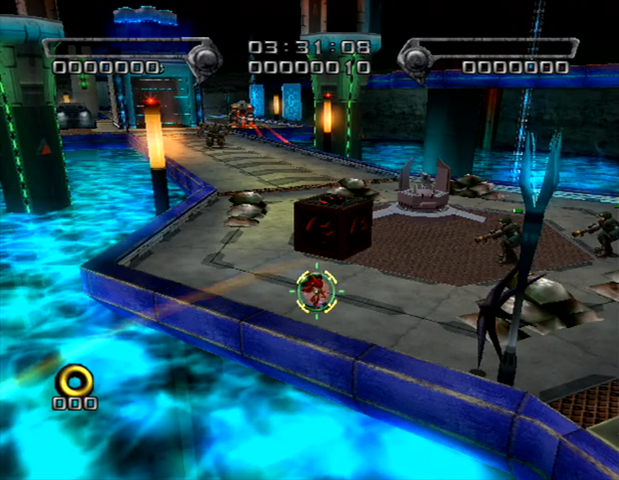

# GUN Fortress

<br />

## Boss After Missions
|Dark|Hero|
|--|--|
|[Sonic and Diablon](../../Bosses/SonicAndDiablon)|[Black Doom](../../Bosses/BlackDoom)|

<br />

## Level Layout
```
<Insert Level Map Here>
```

<br />

## Key Locations
|Key 1|Key 2|Key 3|Key 4|Key 5|
|--|--|--|--|--|
|[  ](../../img/GUNFortress/GUNFortress-Key1.png)|[  ](../../img/GUNFortress/GUNFortress-Key2.png)|[  ](../../img/GUNFortress/GUNFortress-Key3.png)|[  ](../../img/GUNFortress/GUNFortress-Key4.png)|[  ](../../img/GUNFortress/GUNFortress-Key5.png)|

<br />

## Secret Doors
<!--Working space is 830 pixels. Need some extra pixels for spacing.-->
[  ](../img/GUNFortress/GUNFortress-SecretDoor.png)

The Secret Door in GUN Fortress opens up a secret shortcut the skips the triangle jump and long grabrail sections. Very useful in runs.

<br />

## Shadow Boxes
| |Box 1|Box 2|
|-|-|-|
|__Location__|[  ](../img/GUNFortress/GUNFortress-SpecialWeaponsContainer1.png)|[  ](../img/GUNFortress/GUNFortress-SpecialWeaponsContainer2.png)
|__Default Weapon__|Assault Rifle|Assault Rifle

<br />

## Enemies in Stage

<br />

## Weapons Available

<br />

## Notes of Interest

<br />