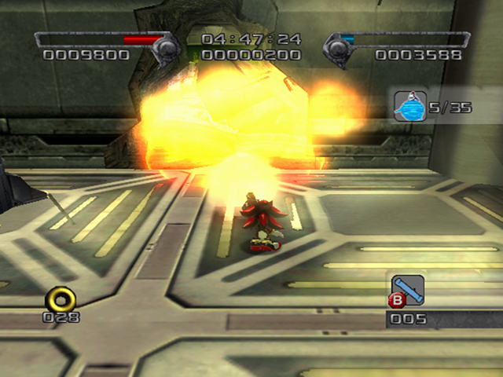
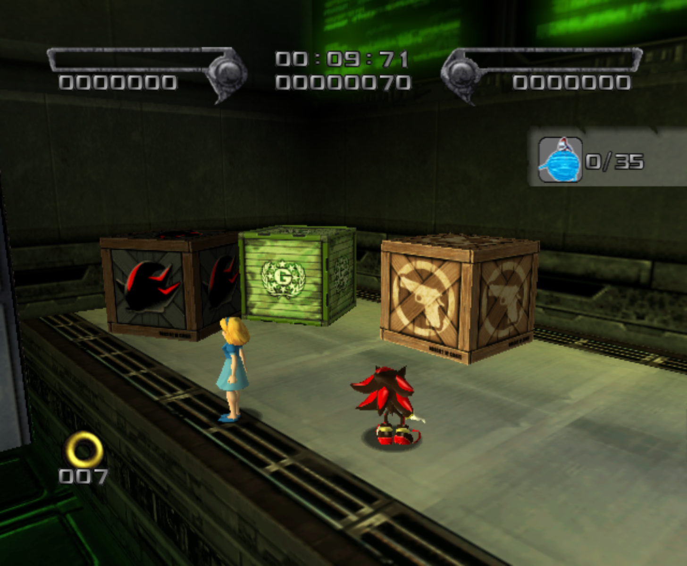

# Lost Impact

<br />

## Next Stages in Story
|Normal|Hero|
|--|--|
|[Cosmic Fall](../CosmicFall)|[Final Haunt](../FinalHaunt)|

<br />

## Level Layout
```
<Insert Level Map Here>
```

<br />

## Key Locations
|Key 1|Key 2|Key 3|Key 4|Key 5|
|--|--|--|--|--|
|[  ](../img/LostImpact/LostImpact-Key1.png)|[  ](../img/LostImpact/LostImpact-Key2.png)|[  ](../img/LostImpact/LostImpact-Key3.png)|[  ](../img/LostImpact/LostImpact-Key4.png)|[  ](../img/LostImpact/LostImpact-Key5.png)|

<br />

## Shadow Boxes
| |Box 1|
|-|-|
|__Location__|[  ](../img/LostImpact/LostImpact-SpecialWeaponsContainer1.png)|
|__Default Weapon__|SMG|

<br />

## Enemies in Stage

<br />

## Weapons Available

<br />

## Notes of Interest

### Artifical Chaos Info
The Artifical Chaos in this level can have different points and health.  This infomation will be useful for routing out the Hero Mission. With this data we can determine that each Chibi that an Artifical Chaos has gives 40 Score Points and 200 Meter Points.

|AC#|Location|AC Chibi Count|Score Points|Meter Points|
|-|-|-|-|-|
|1| |5|200|1000|
|2| |6|240|1200|
|3| |5|200|1000|
|4| |6|240|1200|
|5| |6|240|1200|
|6| |6|240|1200|
|7| |5|200|1000|
|8| |5|200|1000|
|9| |6|240|1200|
|10| |6|240|1200|
|11| |6|240|1200|
|12| |6|240|1200|
|13| |6|240|1200|
|14| |6|240|1200|
|15| |6|240|1200|
|16| |6|240|1200|
|17| |8|320|1600|
|18| |8|320|1600|
|19| |5|200|1000|
|20| |5|200|1000|
|21| |6|240|1200|
|22| |5|200|1000|
|23| |5|200|1000|
|24| |6|240|1200|
|25| |5|200|1000|
|26| |5|200|1000|
|27| |16|640|3200|
|28| |8|320|1600|
|29| |8|320|1600|
|30| |8|320|1600|
|31| |8|320|1600|
|32| |8|320|1600|
|33| |12|480|2400|
|34| |26|1040|5200|
|35| |20|800|4000|
<br />