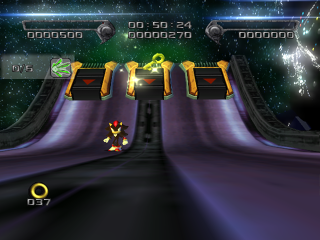
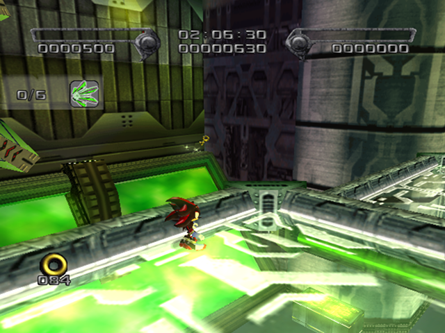
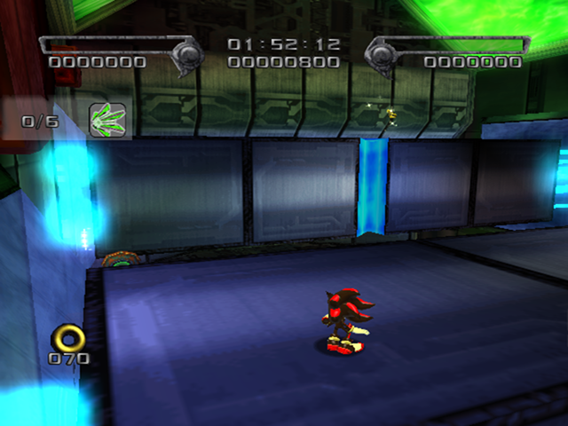
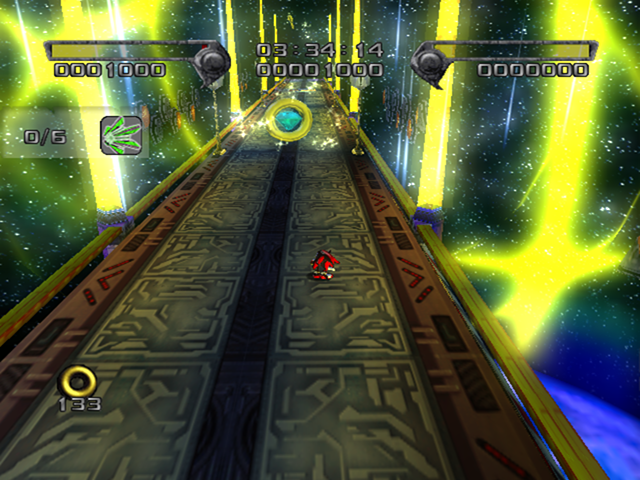

# Space Gadget

<br />

## Next Stages in Story
|Dark|Normal|Hero|
|--|--|--|
|[Lava Shelter](../LavaShelter)|[Cosmic Fall](../CosmicFall)|[Final Haunt](../FinalHaunt)|

<br />

## Level Layout
```
<Insert Level Map Here>
```

<br />

## Key Locations
|Key 1|Key 2|Key 3|Key 4|Key 5|
|--|--|--|--|--|
|[  ](../img/SpaceGadget/SpaceGadget-Key1.png)|[  ](../img/SpaceGadget/SpaceGadget-Key2.png)|[  ](../img/SpaceGadget/SpaceGadget-Key3.png)|[  ](../img/SpaceGadget/SpaceGadget-Key4.png)|[  ](../img/SpaceGadget/SpaceGadget-Key5.png)|

<br />

## Shadow Boxes
| |Box 1|
|-|-|
|__Location__|[  ](../img/SpaceGadget/SpaceGadget-SpecialWeaponsContainer1.png)|
|__Default Weapon__|"Gold" Worm Launcher|

<br />

## Enemies in Stage

<br />

## Weapons Available

<br />

## Notes of Interest

<br />