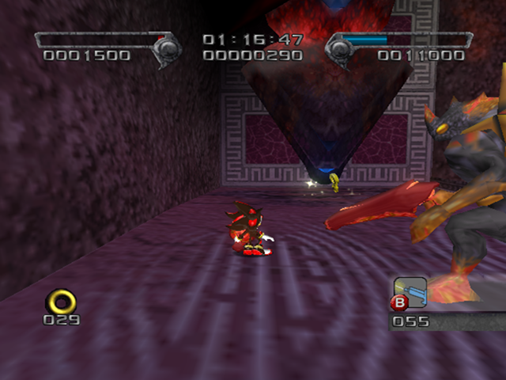
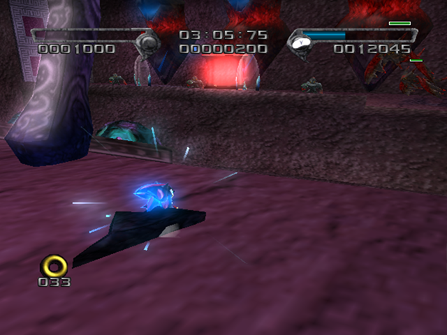
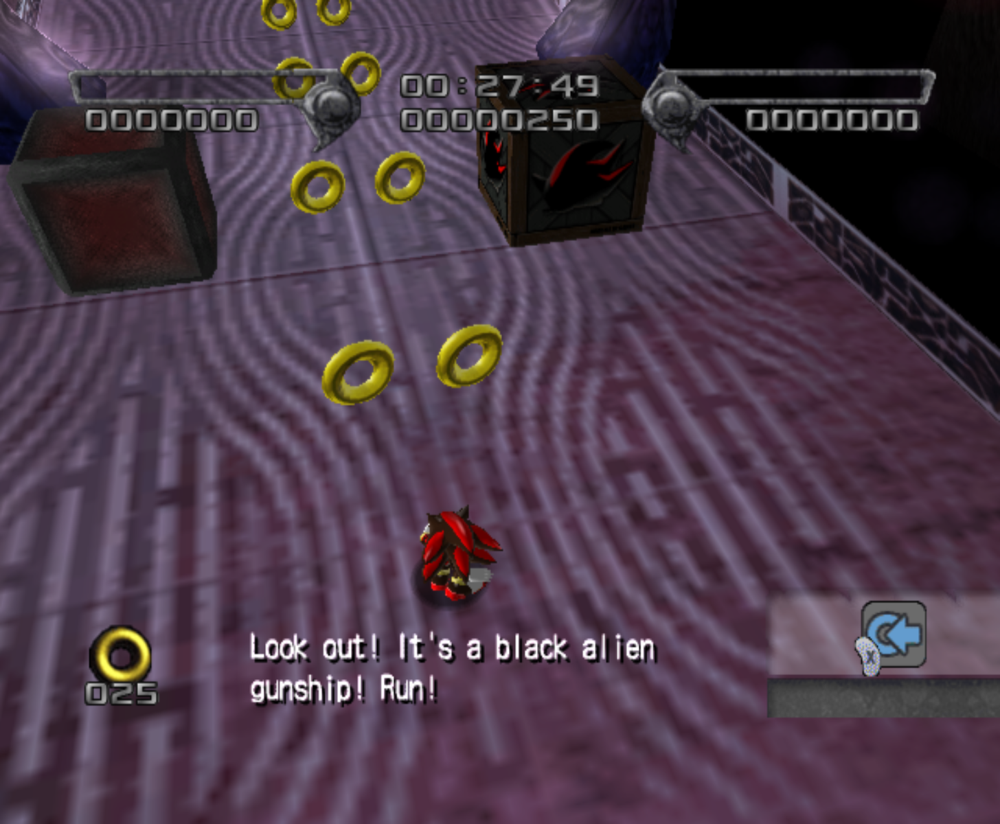
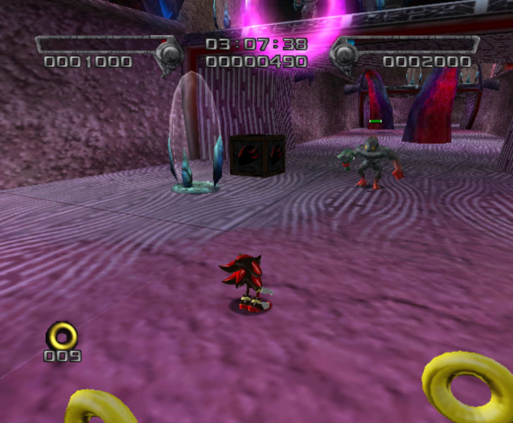

# The Last Way

<br />

## Boss After Mission
[Devil Doom](../Bosses/DevilDoom)

<br />

## Level Layout
```
<Insert Level Map Here>
```

<br />

## Key Locations
|Key 1|Key 2|Key 3|Key 4|Key 5|
|--|--|--|--|--|
|[  ](../img/TheLastWay/TheLastWay-Key1.png)|[  ](../img/TheLastWay/TheLastWay-Key2.png)|[  ](../img/TheLastWay/TheLastWay-Key3.png)|[  ](../img/TheLastWay/TheLastWay-Key4.png)|[  ](../img/TheLastWay/TheLastWay-Key5.png)|

<br />

## Shadow Boxes
Note: You should never be able to use the default weapons in these boxes due already having special weapons by time the stage is available to play.

| |Box 1|Box 2|Box 3 & Box 4|
|-|-|-|-|
|__Location__|[  ](../img/TheLastWay/TheLastWay-SpecialWeaponsContainer1.png)|[  ](../img/TheLastWay/TheLastWay-SpecialWeaponsContainer2.png)|[  ](../img/TheLastWay/TheLastWay-SpecialWeaponsContainer3.png)|
|__Default Weapon__|Ring Shot|Ring Shot|Flash Shot|

<br />

## Enemies in Stage

<br />

## Weapons Available

<br />

## Notes of Interest

<br />