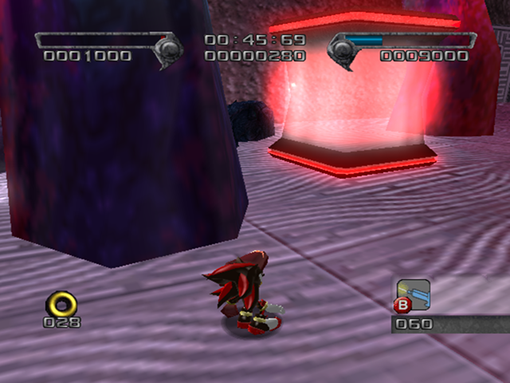
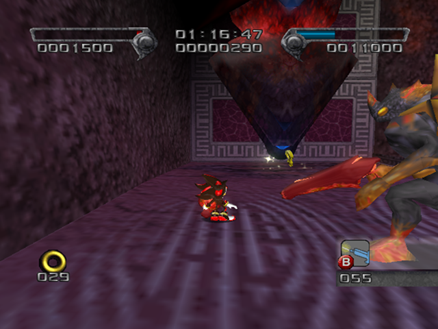
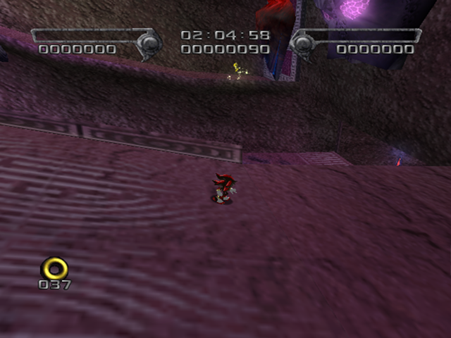
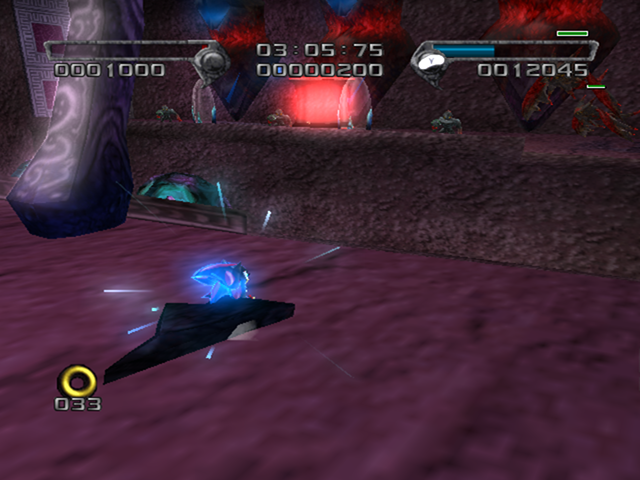
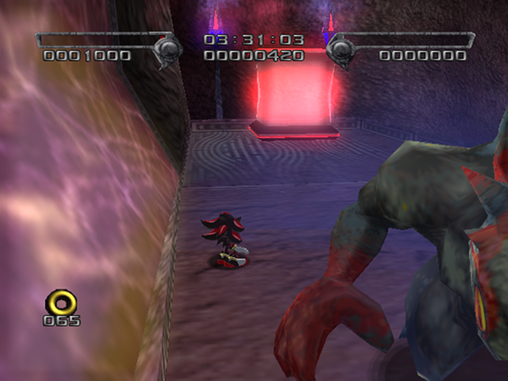

# The Last Way

<br />

## Boss After Mission
[Devil Doom](../../Bosses/DevilDoom)

<br />

## Level Layout
```
<Insert Level Map Here>
```

<br />

## Key Locations
|Key 1|Key 2|Key 3|Key 4|Key 5|
|--|--|--|--|--|
|[  ](../../img/TheLastWay/TheLastWay-Key1.png)|[  ](../../img/TheLastWay/TheLastWay-Key2.png)|[  ](../../img/TheLastWay/TheLastWay-Key3.png)|[  ](../../img/TheLastWay/TheLastWay-Key4.png)|[  ](../../img/TheLastWay/TheLastWay-Key5.png)|

<br />

## Shadow Boxes
| |Box 1|Box 2|
|-|-|-|
|__Location__|X|x
|__Default Weapon__|N/A|(Need Story Endings to unlock this stage)|

<br />

## Enemies in Stage

<br />

## Weapons Available

<br />

## Notes of Interest

<br />