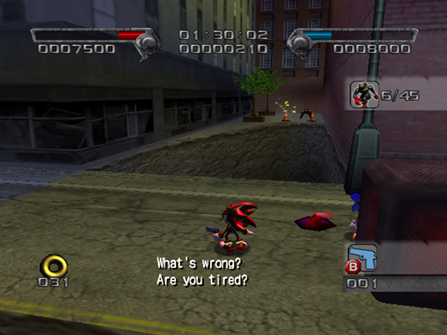
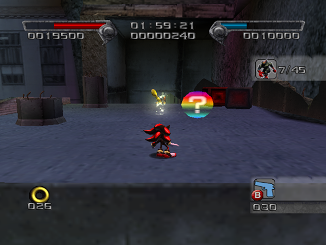
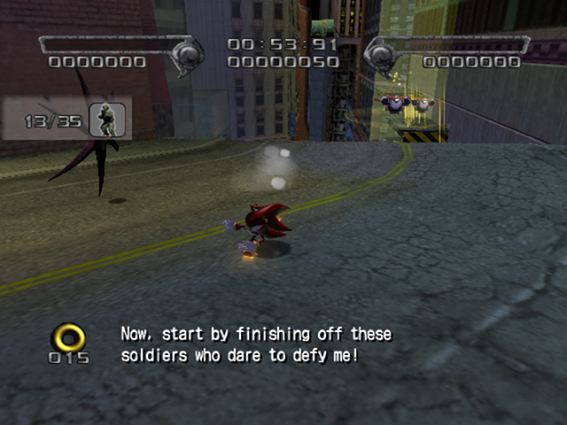
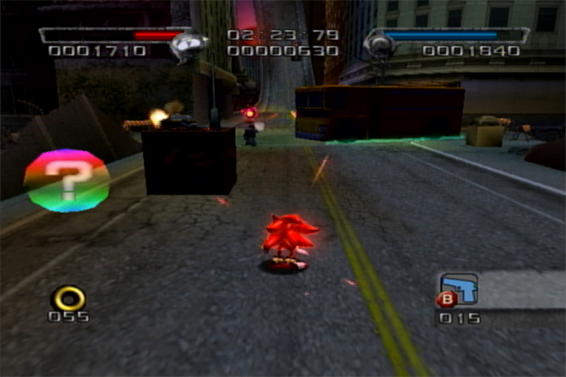

# Westopolis

<br />

## Next Stages in Story
|Dark|Normal|Hero|
|--|--|--|
|[Digital Circuit](../DigitalCircuit)|[Glyphic Canyon](../GlyphicCanyon)|[Lethal Highway](../LethalHighway)|

<br />

## Level Layout
```
<Insert Level Map Here>
```

<br />

## Key Locations
|Key 1|Key 2|Key 3|Key 4|Key 5|
|--|--|--|--|--|
|[  ](../img/Westopolis/Westopolis-Key1.png)|[  ](../img/Westopolis/Westopolis-Key2.png)|[  ](../img/Westopolis/Westopolis-Key3.png)|[  ](../img/Westopolis/Westopolis-Key4.png)|[  ](../img/Westopolis/Westopolis-Key5.png)|

<br />

## Shadow Boxes
| |Box 1|
|-|-|
|__Location__|[  ](../img/Westopolis/WestopolisShadowBox1.png)|
|__Default Weapon__|Flash Shot|

<br />

## Enemies in Stage

<br />

## Weapons Available

<br />

## Expert Mode Differences
This is a quick and dirty list of observed differences listed in the order of appearance.

Helicopter on first fall, which can be used to demage boost to the end of the fall.

There is a Shielded GUN solder with an SMG next to the first Black Warrior.

Missing SMG box after Doom Eye before wall.

Before Second Checkpoint there is no longer a ramp.  A triangle jump or Spin Dash Jump is required to get to the ring path that get you to the second checkpoint.

Platforming for the second checkpoint area is different.

Extra Black Warrior at the bus after checkpoint 3

No ring dash downhill to the first shadow box

Section after 4th checkpoint is different.  Behind the bus that is not normally is there is a second shadow box that is also not normally there.

Goal Ring has been moved the to the real end of the stage.
<br />

## Notes of Interest

<br />